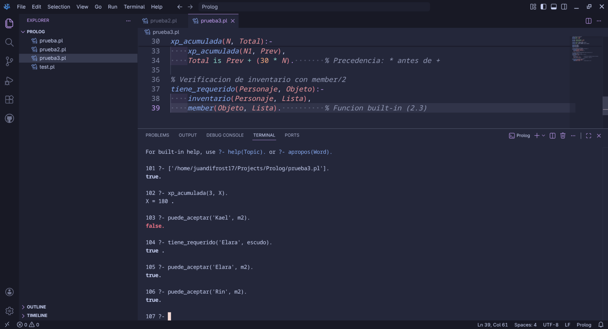
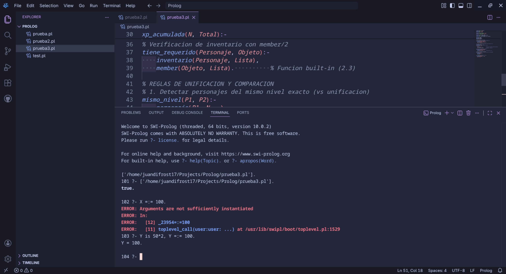
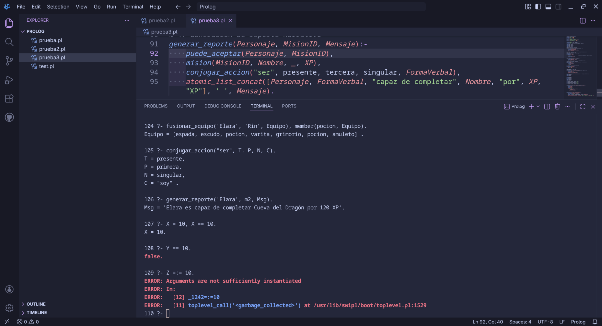
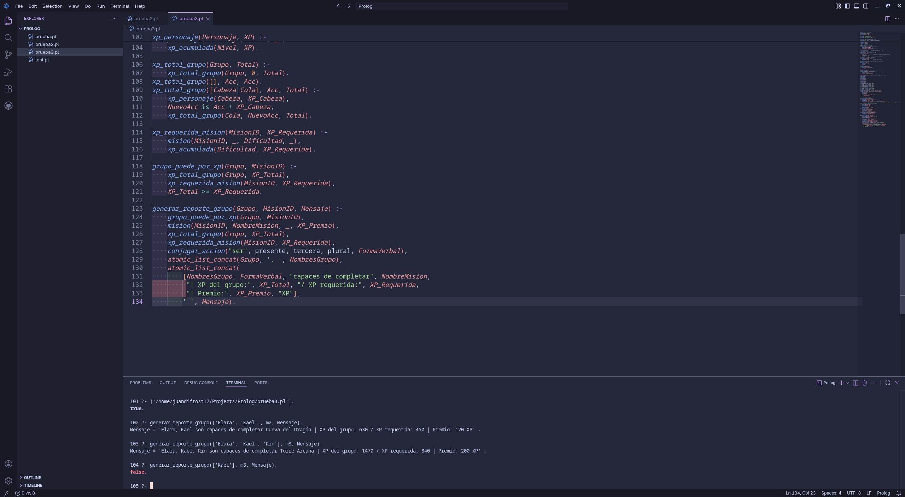
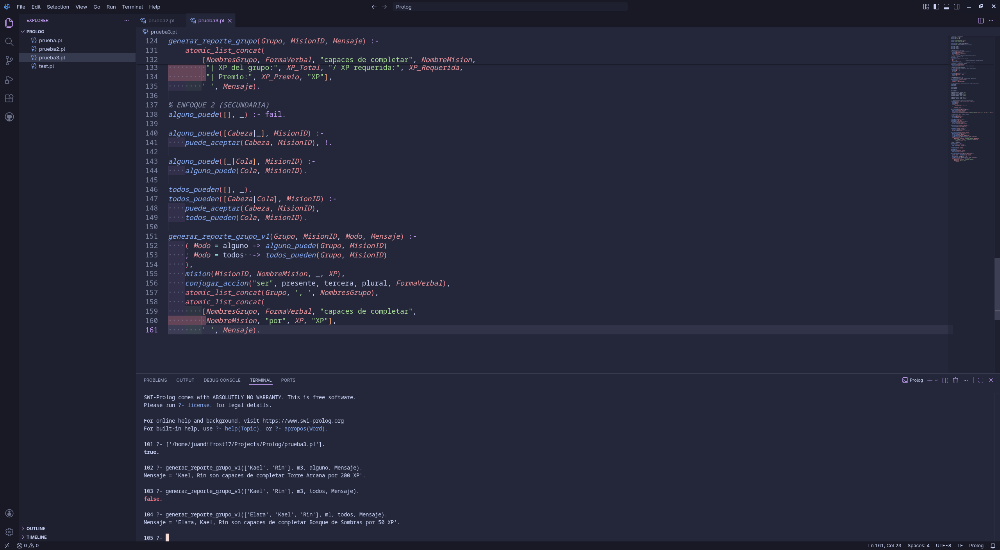

# Taller 4 - Prolog #3 - Narrativa de nivel para misiones

Este código en Prolog modela un sistema básico tipo RPG, donde existen personajes, misiones, niveles, experiencia, inventarios y requisitos. A partir de esta información, el programa permite validar si un personaje o grupo puede participar en una misión y generar reportes narrativos según las condiciones del juego. Se aplican conceptos propios de Prolog como hechos, reglas, listas, recursividad, acumuladores, comparación aritmética, backtracking y construcción de mensajes.

## Ejercicios implementados

### Base de conocimiento del RPG

El programa define los datos principales del juego mediante hechos. Se representan personajes con sus características, misiones con dificultad y recompensa, inventarios de los personajes y objetos requeridos para ciertas misiones. Esta información sirve como base para que las reglas puedan realizar consultas y generar conclusiones.

**Nota:** esta parte usa hechos declarativos para construir la base lógica del programa.

### Validación de misiones e inventarios

El código permite verificar si un personaje puede aceptar una misión comparando su nivel con la dificultad requerida. También permite revisar si un personaje posee determinado objeto dentro de su inventario, utilizando listas y predicados integrados de Prolog.

**Nota:** se trabaja con comparación de valores y búsqueda dentro de listas mediante `member/2`.

### Cálculo de experiencia

Se implementan predicados para calcular experiencia acumulada de forma recursiva. Esta lógica permite obtener valores de XP a partir del nivel de los personajes o de los requisitos asociados a una misión.

**Nota:** se usa recursividad directa con caso base y evaluación aritmética mediante `is/2`.

### Comparación y balance de personajes

El programa incluye reglas para comparar personajes que tienen el mismo nivel y para verificar si un personaje está balanceado según su cantidad de vida. Esta sección permite aplicar condiciones lógicas y aritméticas sobre los datos de los personajes.

**Nota:** se diferencian operaciones de comparación lógica, desigualdad entre términos y comparación numérica.

### Fusión de inventarios

Se implementó una regla para unir los inventarios de dos personajes en una sola lista usando `append/3`. Esto permite representar un equipo combinado con los objetos de ambos integrantes.

**Nota:** se aplica manipulación de listas en Prolog.

### Conjugación de acciones narrativas

El taller incluye predicados para manejar tiempo, persona, número y conjugaciones simples del verbo `ser`. Estos se usan para construir mensajes narrativos más naturales dentro de los reportes.

**Nota:** se emplean reglas condicionales y validación de combinaciones gramaticales.

### Generación de reporte narrativo individual

El programa construye reportes narrativos para un personaje y una misión. Para esto, primero valida si el personaje puede aceptar la misión, luego obtiene los datos necesarios de la base de conocimiento y finalmente genera un mensaje usando concatenación de átomos.

**Nota:** esta sección integra validación lógica, consulta de hechos y generación de texto.

### Generación de reportes grupales

El ejercicio final trabaja con una lista de personajes y se resolvió usando dos enfoques.

El enfoque principal calcula la XP acumulada de todos los personajes del grupo. Para esto, se obtiene la experiencia asociada a cada personaje, se suma la XP total del equipo y luego se compara con la XP requerida por la misión. Si la experiencia acumulada del grupo es suficiente, el reporte indica que el equipo puede completar la misión.

El segundo enfoque revisa jugador por jugador. En este caso, no se suma la experiencia total del grupo, sino que se verifica individualmente si cada personaje tiene el nivel necesario para aceptar la misión. Con esta lógica se puede determinar si algún personaje cumple con el requisito o si todos los integrantes del grupo están preparados.

**Nota:** la diferencia principal entre ambos enfoques es que el primero evalúa la fuerza del grupo como conjunto mediante XP acumulada, mientras que el segundo evalúa a cada personaje de manera individual según su nivel.

## Tabla de predicados implementados

| Predicado | Aridad | Descripción |
|---|---:|---|
| `personaje` | 3 | Hecho que registra el nombre, nivel y vida de un personaje. |
| `mision` | 4 | Hecho que registra el identificador, nombre, dificultad y recompensa de experiencia de una misión. |
| `inventario` | 2 | Hecho que asocia un personaje con una lista de objetos disponibles. |
| `requiere` | 2 | Hecho que indica qué objeto requiere una misión específica. |
| `puede_aceptar` | 2 | Regla que verifica si el nivel de un personaje es mayor o igual que la dificultad de una misión. |
| `xp_acumulada` | 2 | Regla recursiva que calcula la experiencia acumulada para un valor numérico dado. |
| `tiene_requerido` | 2 | Regla que verifica si un personaje posee un objeto dentro de su inventario. |
| `mismo_nivel` | 2 | Regla que identifica dos personajes distintos con el mismo nivel. |
| `es_balanceado` | 1 | Regla que comprueba si la vida de un personaje es exactamente igual a `100`. |
| `fusionar_equipo` | 3 | Regla que concatena los inventarios de dos personajes en una lista resultante. |
| `tiempo` | 1 | Hecho que define tiempos verbales válidos para la conjugación. |
| `persona` | 1 | Hecho que define personas gramaticales válidas. |
| `numero` | 1 | Hecho que define números gramaticales válidos. |
| `ser` | 4 | Hecho que almacena conjugaciones del verbo `ser` según tiempo, persona y número. |
| `conjugar_accion` | 5 | Regla que devuelve la conjugación de una acción según verbo, tiempo, persona y número. |
| `generar_reporte` | 3 | Regla que genera un mensaje narrativo individual para una misión aceptable. |
| `xp_personaje` | 2 | Regla que calcula la experiencia de un personaje a partir de su nivel. |
| `xp_total_grupo` | 2 | Regla pública que inicia el cálculo de experiencia total de un grupo. |
| `xp_total_grupo` | 3 | Regla auxiliar con acumulador para sumar la experiencia de los integrantes del grupo. |
| `xp_requerida_mision` | 2 | Regla que calcula la experiencia requerida a partir de la dificultad de una misión. |
| `grupo_puede_por_xp` | 2 | Regla que verifica si la experiencia total del grupo alcanza la experiencia requerida por la misión. |
| `generar_reporte_grupo` | 3 | Regla que genera un reporte narrativo grupal usando experiencia acumulada. |
| `alguno_puede` | 2 | Regla que verifica si al menos un integrante de un grupo puede aceptar una misión. |
| `todos_pueden` | 2 | Regla que verifica si todos los integrantes de un grupo pueden aceptar una misión. |
| `generar_reporte_grupo_v1` | 4 | Regla que genera un reporte grupal según el modo `alguno` o `todos`. |

## Capturas de ejecución

#### Captura 1 — Validación de experiencia acumulada, aceptación de misión e inventario requerido

#### Captura 2 — Error por comparación aritmética con variable no instanciada y corrección con `is/2`

#### Captura 3 — Fusión de inventarios, conjugación verbal, reporte individual y comparaciones de igualdad

#### Captura 4 — Reportes grupales por experiencia acumulada para misiones `m2` y `m3`

#### Captura 5 — Reporte grupal con modos `alguno` y `todos`

## Archivos del repositorio

| Archivo | Descripción |
|---|---|
| `README.md` | Documento principal del repositorio con la descripción del código, ejercicios implementados, predicados, capturas y archivos. |
| `taller4.pl` | Archivo fuente en Prolog que contiene la base de conocimiento, reglas de inferencia, cálculo de experiencia y generación de reportes narrativos. |
| `Capturas - Prolog 3.pdf` | Documento PDF que recopila evidencias de ejecución del programa en Prolog. |
| `capturas/1.png` | Captura de consultas sobre `xp_acumulada/2`, `puede_aceptar/2` y `tiene_requerido/2`. |
| `capturas/2.png` | Captura que muestra el error de comparación aritmética con variable no instanciada y el uso correcto de `is/2`. |
| `capturas/3.png` | Captura de consultas sobre fusión de inventarios, conjugación del verbo `ser`, generación de reporte individual y pruebas de igualdad. |
| `capturas/4.png` | Captura de consultas de `generar_reporte_grupo/3` con grupos que cumplen o no la experiencia requerida. |
| `capturas/5.png` | Captura de consultas de `generar_reporte_grupo_v1/4` usando los modos `alguno` y `todos`. |
